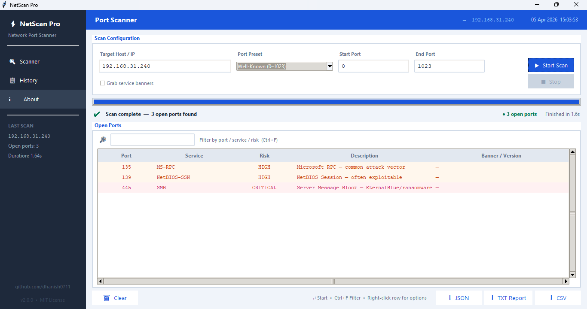

<div align="center">

# ⚡ NetScan Pro

### Advanced Network Port Scanner with GUI

[](https://www.python.org/)
[](LICENSE)
[]()
[]()

A powerful, feature-rich network port scanner with a modern graphical interface built entirely in Python. Identify open ports, assess security risks, grab service banners, and export professional reports — all from an intuitive desktop application.

<br>



</div>

---

## ✨ Features

| Feature | Description |
|---|---|
| 🔍 **Multi-Threaded Scanning** | Scans up to **500 concurrent threads** for blazing-fast results |
| 🎯 **Port Presets** | Quick-select presets: Top 20, Web, Database, Well-Known, Registered, or All 65,535 ports |
| 🛡️ **Risk Assessment** | Color-coded risk levels (**Critical / High / Medium / Low**) for every detected service |
| 📡 **Banner Grabbing** | Optionally grab service banners to identify software versions and configurations |
| 🔎 **Real-Time Filtering** | Instantly filter results by port number, service name, or risk level (`Ctrl+F`) |
| 📊 **Live Progress** | Real-time progress bar, ports/sec speed indicator, and elapsed time |
| 📋 **Scan History** | Browse all past scans in the session with full details |
| 📤 **Multi-Format Export** | Export results as **CSV**, **JSON**, or formatted **TXT reports** |
| 🖱️ **Context Menu** | Right-click any result to copy port, copy full row, or open in browser |
| 🧠 **70+ Known Services** | Built-in database of common services with risk ratings and descriptions |

---

## 🚀 Getting Started

### Prerequisites

- **Python 3.8** or higher
- **Tkinter** (included with most Python installations)

> [!NOTE]
> No external dependencies required — NetScan Pro uses only Python standard library modules.

### Installation

```bash
# Clone the repository
git clone https://github.com/dhanish0711/Network-Port-Scanner.git

# Navigate to the project directory
cd Network-Port-Scanner

# Run the application
python portscanergui.py
```

---

## 🖥️ Usage

### Basic Scan

1. **Enter a target** — Type a hostname (e.g., `scanme.nmap.org`) or IP address
2. **Set port range** — Use a preset or manually enter start/end ports
3. **Click Start Scan** (or press `Enter`)
4. **View results** — Open ports appear in the color-coded results table

### Port Presets

| Preset | Ports |
|---|---|
| Top 20 Common | 21, 22, 23, 25, 53, 80, 110, 139, 443, 445, 1433, 3306, 3389, 5432, 5900, 6379, 8080, 8443, 27017 … |
| Web Ports | 80, 443, 8080, 8443, 8000, 8888, 3000, 4000, 5000 |
| Database Ports | 1433, 1521, 3306, 5432, 6379, 9200, 27017, 27018 |
| Well-Known (0–1023) | Full range of well-known ports |
| Registered (1024–49151) | IANA registered port range |
| All Ports (0–65535) | Complete port scan |

### Banner Grabbing

Enable the **"Grab service banners"** checkbox before scanning to attempt to read service headers from each open port. This reveals software versions (e.g., `Apache/2.4.41`, `OpenSSH_8.2`) but will slow down the scan.

### Keyboard Shortcuts

| Shortcut | Action |
|---|---|
| `Enter` | Start scan |
| `Ctrl+F` | Focus filter field |
| `Right-click` | Context menu on result row |

---

## 🛡️ Risk Levels

NetScan Pro categorizes every detected service with a color-coded risk level:

| Level | Color | Examples |
|---|---|---|
| 🔴 **CRITICAL** | Red | SMB (445), RDP (3389), MySQL (3306), Redis (6379), MongoDB (27017) |
| 🟠 **HIGH** | Orange | FTP (21), Telnet (23), SNMP (161), VNC (5900), NetBIOS (139) |
| 🟡 **MEDIUM** | Yellow | HTTP (80), SMTP (25), IMAP (143), Syslog (514) |
| 🟢 **LOW** | Green | SSH (22), HTTPS (443), IMAPS (993), LDAPS (636) |
| ⚪ **INFO** | Gray | Unknown / unregistered services |

---

## 📤 Export Formats

After a scan completes, export your results in three formats:

### TXT Report
A formatted, human-readable report with a header, scan metadata, and aligned table output — ready to share or archive.

### CSV
Standard comma-separated values with columns: `Port`, `Service`, `Risk`, `Description`, `Banner`, `Timestamp`.

### JSON
Structured JSON output with full scan metadata and an array of open port objects — ideal for automation and integration.

---

## 🏗️ Architecture

```
portscanergui.py
│
├── SERVICE_DB            # Service/risk database (70+ ports)
├── PORT_PRESETS           # Quick-select port range presets
├── grab_banner()          # Banner grabbing utility
│
├── PortScanner            # Core scanner engine
│   ├── resolve()          # DNS resolution
│   ├── run()              # Multi-threaded scan orchestration
│   └── _scan_port()       # Individual port probe
│
└── ScannerGUI (Tk)        # GUI application
    ├── Sidebar            # Navigation + last scan stats
    ├── Header             # Title bar + live clock + DNS info
    ├── Input Panel        # Target, ports, presets, start/stop
    ├── Status Bar         # Progress, speed, elapsed time
    ├── Results Tree       # Sortable, filterable results table
    ├── Footer             # Export buttons + shortcuts help
    ├── History Window     # Past scan browser
    └── About Window       # App info + credits
```

---

## 🤝 Contributing

Contributions are welcome! Here's how you can help:

1. **Fork** the repository
2. **Create** a feature branch (`git checkout -b feature/amazing-feature`)
3. **Commit** your changes (`git commit -m 'Add amazing feature'`)
4. **Push** to the branch (`git push origin feature/amazing-feature`)
5. **Open** a Pull Request

### Ideas for Contribution

- [ ] UDP port scanning support
- [ ] OS fingerprinting
- [ ] Scan scheduling / automation
- [ ] Dark mode theme toggle
- [ ] Subnet / CIDR range scanning
- [ ] Vulnerability CVE lookup integration

---

## ⚠️ Disclaimer

> [!CAUTION]
> **This tool is intended for educational purposes and authorized security testing only.**
> Scanning networks or hosts without explicit permission is illegal in most jurisdictions. Always ensure you have proper authorization before scanning any target. The author assumes no liability for misuse.

---

## 📄 License

This project is licensed under the **MIT License** — see the [LICENSE](LICENSE) file for details.

---

## 👤 Author

**dhanish0711**

- GitHub: [@dhanish0711](https://github.com/dhanish0711)

---

<div align="center">

Made with ❤️ and Python

⭐ **Star this repo if you found it useful!** ⭐

</div>
